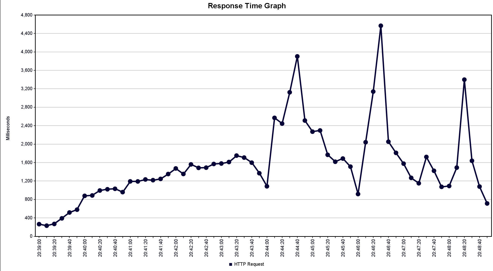

# Redis 기반 분산 예약 대기열 시스템


## A. 프로젝트 명
Redis 기반 분산 예약 대기열 시스템: 티켓팅 시나리오


## B. 프로젝트 멤버 이름 및 멤버 별 담당 파트
 
| 이름   | 담당 파트 및 주요 역할 |
|--------|--------------------------|
| 편경찬 | JMeter 부하 테스트 환경 구축<br> Spring Filter/Interceptor 이용한 접속자 쿠키 발급 |
| 송승우 | AWS 기반 인프라 구성: VPC, 퍼블릭 서브넷, 라우팅 테이블, IGW, 보안 그룹 설정<br> ECS 아키텍처 설계: Fargate 기반의 ECS Cluster, Task Definition, Service 구성<br> 로드 밸런서 설정: ALB, Target Group, Listener를 통한 트래픽 분산<br> 오토스케일링 정책 구성: CloudWatch Metric 기반 ECS 서비스 확장/축소 설정<br> Terraform을 활용한 전체 인프라 코드화 및 자동화 구현 |
| 하창민 | Spring MVC 기반 티켓팅 서비스 구현<br> 쿠키 기반 로그인 세션 관리 및 인증 로직 개발<br> Redis 기반 상태 관리 및 분산 환경 대응<br> 동시성 대응을 위한 상태 기반 예약 처리 로직 구현<br> 프론트엔드와의 통신 최적화 |

## C. 프로젝트 소개
본 프로젝트는 Redis의 다양한 자료구조와 기능을 활용해 확장성 있는 예약 대기열 시스템을 구현한다.

티켓팅 시스템의 대규모 트래픽 처리 문제를 해결하기 위해 AWS Fargate 기반 ECS, Application Load Balancer(ALB), 오토스케일링, 그리고 Redis 기반 상태 공유 시스템을 결합한 사용자 경험 최적화 아키텍처를 구현한다.

수많은 사용자가 동시에 접속하는 환경에서 대기열 설계, 트래픽 분산, 세션 공유, 스마트 라우팅, 오토스케일링까지 하나의 통합된 아키텍처로 구성되었으며, Spring Boot 기반의 WAS, Redis, AWS ECS(Fargate), ALB, CloudWatch 등의 인프라 자원 위에서 운영된다.

주요 기능
- 실시간 방문자 추적 및 세션 관리
- 공정한 예약 대기열(FIFO) 운영
- 동적 시스템 설정 조정
- 분산 환경에서의 동시성 제어
- jmeter 이용한 부하 테스트
- ALB 기반 트래픽 분산 및 CloudWatch 기반 오토스케일링


## D. 프로젝트 필요성 소개

기존의 단일 인스턴스 기반 웹서비스 또는 세션 스티키 로드밸런싱 기반의 구조에서는 아래와 같은 문제가 발생한다:
- 세션을 유지하려면 같은 인스턴스를 계속 사용해야 하며, 이는 장애 발생 시 치명적
- 사용자 대기열이나 우선순위 처리를 인스턴스 로컬 메모리로 처리하면 스케일아웃 불가
- Scale Out 시 새로운 인스턴스가 사용자 상태를 인식하지 못함

이를 해결하기 위해 Redis를 도입하여 인스턴스 간 상태 공유, 사용자 식별, 지능형 라우팅, 글로벌 대기열을 구현함으로써 다음과 같은 장점을 얻는다:
- 실시간 성능
- 공정한 대기열 
- 중복 요청 방지 
- 동적 설정 
- 분산 락


## E. 관련 기술/논문/특허 조사 내용 소개

- Redis Session Store
  - Spring Session + Redis 공식 문서
  - 다양한 인스턴스에서 동일한 세션 정보를 공유 가능

- Queueing Model for Ticketing Systems
  - IEEE: Designing Scalable Ticketing Systems for High-Concurrency Events
  - 사용자 상태 기반의 대기열 관리 방식 제안

- AWS Fargate 기반 서버리스 아키텍처
  - EC2 인스턴스 없이도 컨테이너를 실행할 수 있는 서버리스 환경 제공
  - Task 단위로 확장되며, 유지보수가 용이하고 오토스케일링과의 연동이 뛰어남

- Application Load Balancer(ALB)를 활용한 트래픽 분산
  - L7 계층에서 동작하는 로드밸런서로, 경로 기반 라우팅, 헬스 체크, Sticky Session 등을 지원
  - 다수의 ECS Task 간 트래픽 분산 및 상태 기반 제어 가능

- CloudWatch 기반 오토스케일링 정책
  - ECS 서비스의 CPU 사용률을 기반으로 자동 확장 및 축소 수행
  - Step Scaling 방식으로 민감하게 트래픽 변화 대응 가능

- Terraform 기반 Infrastructure as Code (IaC)
  - 인프라 리소스를 코드로 선언하고 관리할 수 있는 도구


## F. 프로젝트 개발 결과물 소개  (+다이어그램)
- 시스템 아키텍처


- 핵심 컴포넌트
    ```shell
    src/
    ├── config/                       # Redis/Spring 설정
    ├── controller/                   # API 엔드포인트
    ├── filter/                       # 방문자 추적
    ├── service/                      # 비즈니스 로직
    │   ├── BookingService.java       # 예약 신청 및 상태 조회
    │   ├── RedisVisitorQueueService  # 사용자 등록
    │   ├── LoginService.java         # 사용자 인증
    │   └── RedisSettingsService.java # Redis 기반 시스템 설정 관리
    ├── interceptor/                  # 로그인 상태 확인용 인터셉터
    ├── processor/                    # 예약 대기열 비동기 처리
    └── model/                        # 도메인 및 응답 모델

    ```


- 주요 기능
  1. 방문자 추적 및 관리 시스템
     - 모든 요청에 대해 필터링하여 방문자 쿠키 확인/생성
     - UUID로 생성된 고유 visitor_id를 쿠키와 세션에 저장
     - 방문자 정보를 Redis에 저장
     - visitor_id는 이후 로그인/예약 처리에 고유 식별자로 사용
  2. 로그인 시스템
     - 사용자 ID와 비밀번호를 기반으로 인증 (현재는 더미 검증)
     - 인증 성공 시 양방향 매핑을 Redis에 저장하여 세션 관리
       - login:id-cookie (Hash): id → cookie(visitor_id)
       - login:cookie-id (Hash): cookie(visitor_id) → id
     - 로그인 상태는 Redis의 매핑을 기반으로 각 사용자에게 상태 표시됨
  3. 예약 대기열 시스템
     - 4개의 주요 Redis 자료구조 사용:
       - booking:queue:list (List): 예약 요청 대기열 (FIFO)
       - booking:queued:set (Set): 대기열 사용자 집합 (중복 방지)
       - booking:booked:set (Set): 예약 확정 사용자 집합
       - booking:rejected:set (Set): 예약 실패 사용자 집합
     - 사용자의 현재 예약 상태 확인은 BookingStatus 내부 변수를 사용:
       - BOOKED: 예약 완료
       - QUEUED: 예약 신청 진행 중
       - REJECTED: 예약 실패(신청하였지만 예약 안됨)
       - NOT_FOUND: 아직 신청하지 않음
     - 사용자는 처음 접속했을 때 NOT_FOUND 상태
     - 예약 신청 직후 상태는 QUEUED으로 설정되고, 스케줄러에서 실제 예약 처리
       - 예약 정원이 가득 찼을 경우,
         - 사용자 ID를 booking:rejected:set에 저장
         - 사용자는 REJECTED 상태로 설정
       - 예약이 가능한 경우,
         - 사용자 ID를 booking:booked:set에 저장
         - 사용자는 BOOKED 상태로 설정
     - 스케줄러는 분산 락(booking:lock) 구현으로 동시성 제어 (5초 TTL)
     - maxBooking 설정값에 따라 예약 정원 관리
  4. 동적 설정 관리 시스템
      - 애플리케이션 시작 시 기본 설정값 자동 생성:
        - maxBooking: 3 (예약 가능 인원)
        - visitorTTLMinutes: 10 (방문자 세션 유지 시간)
        - bookingLockTTLSeconds: 5 (분산락 TTL)
     - Redis Setting
       - Redis의 Hash (booking:settings)에 설정을 저장
       - 모든 시스템은 주기적으로 Redis에 저장된 설정 값을 참조
       - 관리자 페이지(/system)에서 실시간으로 최대 예약자 수 변경 가능
  5. 트래픽 제어 시스템
     - "/" 및 "/ticketing" 경로에 대한 요청 인터셉트
     - 방문자 정보를 Redis에 저장 
  6. 관리자 대시보드
     - /system 경로로 설정값 조회/수정 기능 제공
     - RedisSettingsService와 연동하여 실시간 설정 관리
  7. Redis 사용 패턴 요약

     | Redis Key              | 용도                       | 자료구조              |
     | ---------------------- | ------------------------ | ----------------- |
     | `booking:settings`     | 시스템 전체 설정값 저장            | Hash              |
     | `booking:booked:set`   | 예약 확정된 사용자 목록            | Set               |
     | `booking:rejected:set` | 예약 거절된 사용자 목록            | Set               |
     | `booking:queued:set`   | 대기열에 등록된 사용자 목록          | Set               |     
     | `booking:queue:list`   | 예약 요청 순서를 유지하기 위한 큐      | List            |
     | `login:id-cookie`	    | 사용자 ID → visitor_id (cookie) 매핑 | 	Hash          |
     | `login:cookie-id`	    | visitor_id (cookie) → 사용자 ID 매핑 | 	Hash          |
     | `booking:lock`         | 예약 처리에 대한 분산락            | String (with TTL) |

  8. 시스템 흐름
     1. 사용자 접속 → VisitorCountingFilter가 visitor_id 생성/확인
     2. 로그인(/login) → LoginService가 Redis에 id와 visitor_id 매핑해서 저장
     3. 예약 요청(/apply) → BookingService가 대기열 등록
     4. 스케줄러가 최대 예약자 수 기반, 주기적 대기열 처리
     5. 예약 상태 및 설정값은 모두 Redis를 통해 조회되고 UI에 반영
     6. 관리자는 /system 페이지에서 실시간으로 시스템 설정 조정

- infra
  

  - VPC 및 퍼블릭 서브넷 2개: 서로 다른 AZ에 분산 배치하여 고가용성 확보
  - ECS Fargate 기반 서비스: 컨테이너를 실행하며, Task 자동 확장/축소 지원
  - Application Load Balancer (ALB): 외부 트래픽 수신 및 Target Group으로 분산
  - CloudWatch + Auto Scaling: CPU 사용률 기반으로 ECS Task 수 자동 조절
  - Terraform IaC: 전체 인프라를 코드로 관리해 재현성과 유지보수 용이

- 부하 테스트 시나리오
  - Jmeter 셋팅
    - Threads : 6000
    - Ramp-Up Period : 480 
    - Loop Count : 500
    - Keep Alive : ON
  

## G. 개발 결과물을 사용하는 방법 소개 (설치 방법, 동작 방법 등)
- redisqueue
  1. 프로젝트 실행 환경
     - Java 17 이상
     - Gradle 8.x 이상
     - Docker (선택 사항, 로컬 Redis 또는 앱 컨테이너 실행용)
     - Redis 서버 (로컬 또는 Docker 기반 실행 권장)
     - IntelliJ IDEA (또는 다른 Java IDE)

  2. 설치 및 초기 설정
     - GitHub에서 프로젝트 클론:
      ```bash
        git clone https://github.com/pnuAccount/Cloud-Computing.git
        cd Cloud-Computing
      ```
     - Redis 서버 실행
      (로컬 Redis를 사용할 경우 Docker 이용 가능):
        - 로컬 Redis 실행 명령어
        ```bash
          docker run --name redis-local -p 6379:6379 -d redis
        ```
        - 혹은 기존의 Redis 서버 이용 (application.properties 설정 필수)
     - application.properties 설정
       - Redis 서버 주소 및 포트 등 환경 설정을 지정하는 파일
       - 위치: Cloud-Computing/redisqueue/src/main/resources/application.properties
       - 주요 구성은 다음과 같음
        ```properties
          spring.application.name=       # 애플리케이션 이름 (로깅, 구성 등에 사용)
          server.port=                   # 웹 서버 포트 (기본: 8080)

          spring.data.redis.host=        # Redis 서버의 호스트 IP 또는 도메인
          spring.data.redis.port=        # Redis 포트 (기본: 6379)
          spring.data.redis.password=    # Redis 비밀번호
          spring.redis.ssl.enabled=      # SSL 사용 여부(보통은 false, 보안 Redis 서버일 경우 true)

          # 로컬 Redis에서 테스트할 경우, 다음과 같이 설정
          #  spring.application.name=redisqueue
          #  server.port=8080

          #  spring.data.redis.host=localhost
          #  spring.data.redis.port=6379
          #  spring.redis.ssl.enabled=false
        ```

  3. 애플리케이션 실행 (로컬 개발용)
     - IntelliJ에서 실행 (로컬)
       1. IntelliJ로 프로젝트를 열기
       2. 'redisqueue/src/main/java/cloud/term/redisqueue/RedisqueueApplication.java' 파일 열기
       3. main() 함수에서 실행
       4. 실행 후 브라우저에서 `http://localhost:8080` 접속
     - 터미널에서 실행 (로컬)
       1. 최상위 redisqueue 디렉토리에서 다음 명령어 실행:
         ```bash
           ./gradlew bootRun
         ```
       2. 실행 후 브라우저에서 `http://localhost:8080` 접속

  4. Docker로 패키징 및 실행 (Docker 필요)
     - ※ Dockerfile은 최상위 redisqueue 디렉토리 (`Cloud-Computing/redisqueue/`)에 위치
     - 도커 명령어로 실행
       1. Gradle 빌드 (JAR 생성):
          - 최상위 redisqueue 디렉토리에서 다음 명령어 실행:
         ```bash
           ./gradlew build
         ```
          - build/libs/redisqueue-0.0.1-SNAPSHOT.jar 생성 확인
       2. Docker 이미지 빌드:
         ```bash
           docker build -t redisqueue-app .
         ```
       3. Docker 컨테이너 실행:
         ```bash
           docker run -d -p 8080:8080 --name redisqueue-container redisqueue-app
         ``` 
       4. 실행 후 브라우저에서 `http://localhost:8080` 접속

       5. Docker 실행 동작 확인
         ```bash
           docker ps                          # 실행 중인 컨테이너 확인
           docker logs redisqueue-container   # 로그 출력
         ```
  5. 동작 방식
     - 이 애플리케이션은 Redis를 이용한 간단한 대기열(Ticket Queue) 시스템을 구현합니다.
     - 사용자는 로그인 후 예약 신청 가능
       1. id 및 비밀번호 입력 후 '로그인' 클릭
       2. 화면에 출력되는 '예약 신청' 클릭
          1) 예약 성공 시, 예약 성공 페이지로 이동
          2) 예약 실패 시, 실패 메시지 출력
       3. 오른쪽에 출력되는 'Current Status'로 예약 상태 확인 가능
     - 관리자는 시스템 페이지에서 최대 예약 신청 인원 설정 가능
       1. 현재 주소에서 '/system' 추가 입력 (예: localhost:8080/system) 
       2. 설정 값 변경 후 '설정 저장' 클릭
       3. 약간의 지연 시간 후 모든 서버에 정보 반영

- infra

1. ECR 이미지 경로 설정
   
'''
cd infra
echo 'ecr_image = "ecr이미지 경로"' > terraform.tfvars
'''

2. Terraform 명령어 실행

'''
terraform init   # Terraform 초기화
terraform plan   # 리소스 변경사항 확인
terraform apply  # 인프라 생성
'''

## H. 개발 결과물의 활용방안 소개

- 적용 가능 분야
  - 대규모 티켓팅 서비스
    - 인기 콘서트, 스포츠 경기 예매 시 수십만 명이 동시 접속해도 일관된 사용자 경험 보장
    - 사용자 순서 유지 + 재접속 지원 → 공정성과 유저 만족도 확보
  - 스마트 로드밸런싱 아키텍처
    - 유저 등급, 요청 유형, 응답 시간 기반 트래픽 분산 정책 설계에 활용
    - VIP 우선, 봇 차단, 대기 사용자 분산 등 정책 적용 가능
  - 간편한 오토스케일링 트리거 설계
    - Redis에 기록된 인스턴스 상태 데이터 기반으로 수동/자동 스케일링 구현 가능
    - Prometheus 등 외부 모니터링 시스템 없이도 자체 지표 수집 가능
  - 트래픽 통제 및 DDoS 완화
    - 사용자 요청 빈도와 TTL을 Redis로 관리하여 비정상적인 트래픽 감지 및 차단 가능

